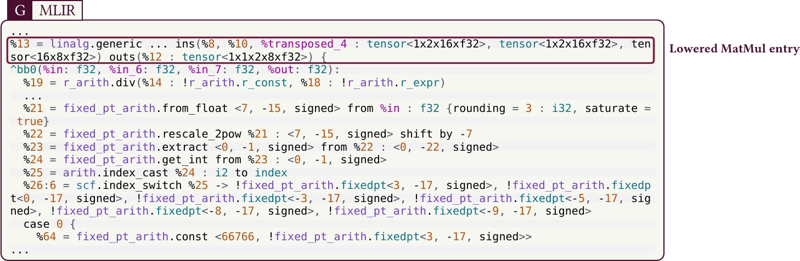
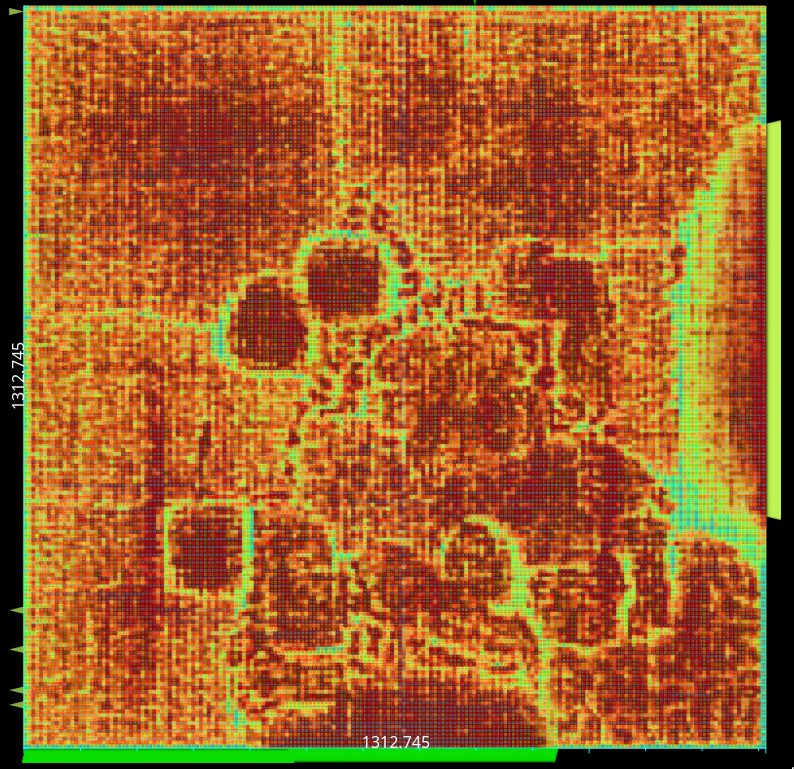
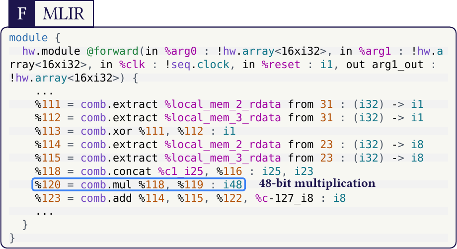

   

# Pattern-Guided Arithmetic Optimizations with MLIR & TinyTapeout (`ttsky26a`)

This repository is a TinyTapeout artifact for a simple but important compiler idea: keep arithmetic decisions visible until they become hardware, then validate that path on a small, real design.

The design is `tt_um_lledoux_s3fdp_seqcomb`, a streaming wrapper around a generated floating-point accumulation core.
It targets open-source silicon through TinyTapeout on Sky130.

The repository is also a compact, reproducible view of a line of work spanning several levels of the hardware/software stack: arithmetic-oriented [MLIR](https://mlir.llvm.org/) design (a multi-level compiler IR), lowering passes in `emeraude-mlir` (my arithmetic-oriented MLIR compiler repository, not yet open), supporting [CIRCT](https://github.com/llvm/circt) contributions (hardware-oriented compiler infrastructure built on MLIR), and my [FloPoCo2](https://gitlab.com/flopoco/flopoco/-/tree/dev/lledoux) refactoring work toward IR generation for arithmetic circuits, needed to keep floating-point datapaths compiler-visible instead of opaque.

## Motivation

[MLIR](https://mlir.llvm.org/) and [CIRCT](https://github.com/llvm/circt) already provide a strong path from high-level programs to structural hardware, especially for control flow, memory, and integer-style datapaths. The weak point is floating-point realization near the circuit boundary. At exactly the stage where ASIC and FPGA flows want explicit wires, operators, and registers, floating-point regions often become opaque, remain trapped in HLS-style abstractions, or are handed off to external generators as black-box blocks.

That loss of visibility matters because this is where the interesting tradeoffs become concrete: area, latency, rounding points, exception handling, and opportunities for fusion or specialization. In other words, floating-point arithmetic is still "just hardware" at this level, but current compiler flows do not always expose it that way.

This repository focuses on that missing step. Concretely, it shows how a small floating-point kernel can be lowered into explicit compiler-visible `comb`/`hw`/`seq` structure before final RTL export, so arithmetic remains available to the compiler as something that can still be inspected, transformed, and specialized.

The motivation is therefore practical. The artifact is meant to show the continuity between several pieces of work that are often separated in practice: arithmetic-oriented IR choices, lowering passes, structural compiler cleanup near the CIRCT boundary, and arithmetic-generator integration. The value of the example is not only that it produces a small chip, but that the intermediate transformations remain visible and reproducible.

In this flow, CIRCT utilities such as `map-arith-to-comb` are useful, but they are not a complete floating-point structuralization path for the kernels targeted here. This artifact documents the additional lowering step used to close that gap on a compact example.

## What Is Implemented Here

This repository brings together work I contributed at several layers:

- arithmetic-aware lowering in `emeraude-mlir`, my current arithmetic-oriented MLIR compiler repository, including the path used here to move from `arith`/`scf`/`memref` programs to explicit hardware-oriented structure
- arithmetic IR work around multi-level compilation, real-number expressions, fixed-point or specialized accumulation, and compiler-visible numeric choices
- supporting [CIRCT](https://github.com/llvm/circt)-side transformations that make the later structural lowering stages cleaner for this kind of flow
- FloPoCo2 refactoring work for IR generation, exposed in [this development branch](https://gitlab.com/flopoco/flopoco/-/tree/dev/lledoux), that exports floating-point hardware as an internal combinational graph rather than stopping at standalone HDL emission
- TinyTapeout integration, wrapper design, and test scaffolding that tie those pieces into a reproducible open artifact

## FloPoCo Integration In This Flow

In this repository, FloPoCo is not used only as an external generator. The relevant piece is my FloPoCo2 refactoring work toward IR generation, available in [this development branch](https://gitlab.com/flopoco/flopoco/-/tree/dev/lledoux), which exposes arithmetic as an internal combinational graph (CombAST-style) that compiler passes can import and lower instead of only emitting standalone HDL.

This makes the generated datapath part of the compiler pipeline itself. In practice, it keeps floating-point structure visible across lowering stages and allows it to interact with the MLIR/CIRCT transformations used in this artifact.

Active branch used by this work:

- FloPoCo2 development branch carrying this IR-generation refactoring: https://gitlab.com/flopoco/flopoco/-/tree/dev/lledoux

The concrete flow in this repository combines:

- [MLIR](https://mlir.llvm.org/) for source pattern capture
- `emeraude-mlir` (my current repository, not yet open) for lowering and arithmetic specialization
- [FloPoCo2 development branch `origin/dev/lledoux`](https://gitlab.com/flopoco/flopoco/-/tree/dev/lledoux) for arithmetic generation and IR export
- [CIRCT](https://github.com/llvm/circt) for structural lowering and SystemVerilog export

## From Llama context to this tiny chip

The kernel used here is intentionally small, but it comes from the same family of Python/LLM workloads discussed in the companion material: SwiGLU-style and matmul-dominated regions where multiply-add structure is abundant and arithmetic lowering choices matter.

One lowered MLIR stage from that broader LLaMA-derived path is shown below.



Companion context figure:



In this artifact, we keep one compact loop-accum kernel so it fits TinyTapeout while still showing the full compiler path.

```mlir
scf.for %k = %c0 to %c2 step %c1 {
  %x = memref.load %a[%k] : memref<2xf32>
  %y = memref.load %b[%k] : memref<2xf32>
  %acc = memref.load %c[%c0] : memref<2xf32>
  %m = arith.mulf %x, %y : f32
  %s = arith.addf %acc, %m : f32
  memref.store %s, %c[%c0] : memref<2xf32>
}
```

Source: `flow/mlir/s3fdp_loop_accum.mlir`

## Arithmetic specialization and comb stage

Specialization is configured in `scripts/generate_s3fdp_core.sh`:

- `s3fdp.ovf=2`
- `s3fdp.msb=4`
- `s3fdp.lsb=-6`
- `s3fdp.chunk_size=16`

A representative comb-level view produced in the flow is shown below:



You can inspect the exact IR stages in:

- `generated/ir-stages/20-flopoco-comb.mlir`
- `generated/ir-stages/60-hw-aggregate.mlir`
- `generated/ir-stages/90-hw-to-sv.mlir`

Here CIRCT serves as the structural backend, while the floating-point path is made explicit through `flopoco-arith-to-comb`, the surrounding arithmetic-specialization work in `emeraude-mlir`, and the FloPoCo2 IR-generation refactoring above.

## TinyTapeout wrapper behavior

Top module: `tt_um_lledoux_s3fdp_seqcomb`

Protocol:

- input frame: 20 bytes (`a[2]`, `b[2]`, `c0`, little-endian)
- run latency: 3 cycles
- output: one 32-bit result over 4 bytes
- slot cadence: `20 + 3 + 4 = 27` cycles

Waveform snapshot:


## Reproduce

Generate core + IR artifacts:

```sh
./scripts/generate_s3fdp_core.sh
```

Run RTL test:

```sh
python3 -m venv .venv
. .venv/bin/activate
pip install -r test/requirements.txt
make -C test -B
```

Test vector in `test/test.py`:

- `a=[1.0, 0]`
- `b=[1.0, 0]`
- `c0=0.0`
- expected result `0x3F800000`

## Related material

- HAL profile: https://cv.hal.science/louis-ledoux
- `Towards Optimized Arithmetic Circuits with MLIR` (HAL): https://hal.science/hal-05385229v1
- `Towards Multi-Level Arithmetic Optimizations` (HAL): https://hal.science/hal-05063466v1
- `Arithmetic Lowering with Emeraude-MLIR: Bridging Tensor and DSP Kernels to Silicon Datapaths` (HAL): https://hal.science/hal-05489427v1
- `An Open-Source Framework for Efficient Numerically-Tailored Computations` (HAL): https://hal.science/hal-04277512v1
- `LLMMMM: Large Language Models Matrix-Matrix Multiplications Characterization on Open Silicon` (HAL): https://hal.science/hal-04592229v1
- PhD thesis, `Floating-Point Arithmetic Paradigms for High-Performance Computing: Software Algorithms and Hardware Designs` (HAL): https://theses.hal.science/tel-04754167v3
- FloPoCo2 development branch used in this flow, carrying the IR-generation refactoring: https://gitlab.com/flopoco/flopoco/-/tree/dev/lledoux
- CIRCT contribution, `convert-index-to-uint` transform: https://github.com/llvm/circt/pull/9263
- CIRCT contribution, multi-result `scf.index_switch` support: https://github.com/llvm/circt/pull/9245
- CIRCT commit for `convert-index-to-uint`: https://github.com/llvm/circt/commit/ca026ed66c8f33d421467d80856d86c6bcefae27
- CIRCT commit for multi-result `scf.index_switch`: https://github.com/llvm/circt/commit/fa7eb12bf52d4433bf372801a598ade775a9e16c
- MLIR: https://mlir.llvm.org/
- CIRCT: https://github.com/llvm/circt
- TinyTapeout: https://tinytapeout.com/
- FloPoCo main: https://gitlab.com/flopoco/flopoco
- `emeraude-mlir`: my current repository, not yet open
- This artifact repo: https://github.com/Bynaryman/ttsky26a

## Cite This Work

Selected references related to this repository:

```bibtex
@inproceedings{cochard2025multilevel,
  author = {Pierre Cochard and Luc Forget and Florent de Dinechin and Louis Ledoux},
  title = {Towards Multi-Level Arithmetic Optimizations},
  booktitle = {EuroLLVM 2025},
  address = {Berlin, Germany},
  year = {2025},
  url = {https://hal.science/hal-05063466v1},
  note = {Poster}
}

@article{ledoux2025optimizedmlir,
  author = {Louis Ledoux and Pierre Cochard and Florent de Dinechin},
  title = {Towards Optimized Arithmetic Circuits with MLIR},
  journal = {WiPiEC Journal: Works in Progress in Embedded Computing},
  volume = {11},
  number = {1},
  year = {2025},
  doi = {10.64552/wipiec.v11i1.90},
  url = {https://hal.science/hal-05385229v1},
  note = {Associated conference presentation at DSD 2025}
}

@misc{ledoux2026circtflopoco,
  author = {Louis Ledoux and Pierre Cochard and Florent de Dinechin},
  title = {Floating-Point Datapaths in CIRCT via FloPoCo AST Export and flopoco-arith-to-comb Lowering},
  howpublished = {Poster presentation at the EuroLLVM Developers' Meeting 2026},
  address = {Dublin, Ireland},
  year = {2026}
}

@misc{ledoux2026emeraude,
  author = {Louis Ledoux and Pierre Cochard and Florent de Dinechin},
  title = {Arithmetic Lowering with Emeraude-MLIR: Bridging Tensor and DSP Kernels to Silicon Datapaths},
  howpublished = {Presentation at the PEPR IA Embarqu{\'e}e Workshop},
  address = {Aussois, France},
  year = {2026},
  url = {https://hal.science/hal-05489427v1}
}

@misc{ledoux2025holigrail,
  author = {Louis Ledoux and Pierre Cochard},
  title = {FloPoCo and MLIR: a Multi-Level Compilation Framework for Many Intents},
  howpublished = {Holigrail Seminar, Sorbonne University},
  address = {Paris, France},
  year = {2025}
}
```

## License

Apache-2.0 (see `LICENSE`).
